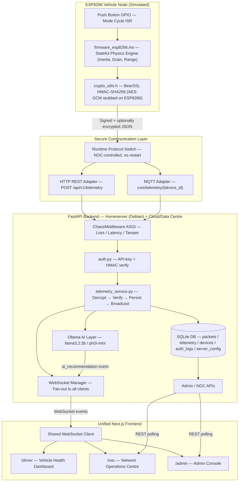
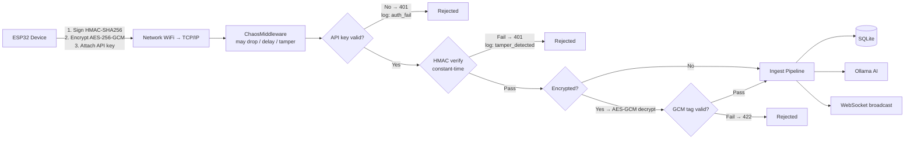
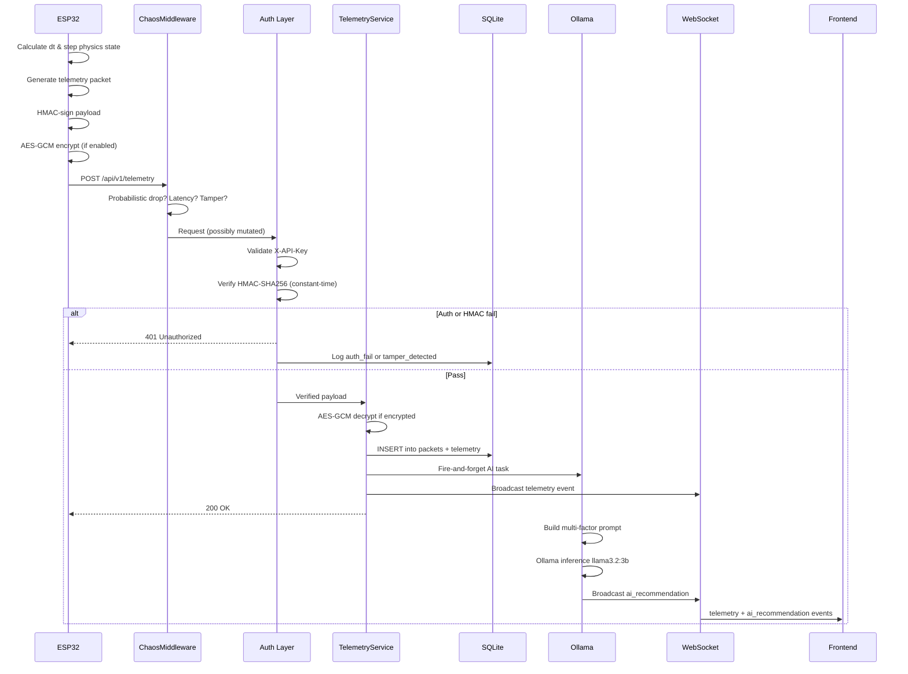
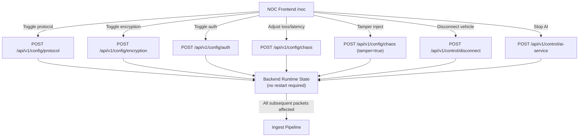

# CVIS — Architecture Diagrams

---

## 1. System Overview

```mermaid
graph TB
    subgraph ESP32["ESP8266 Vehicle Node (Simulated)"]
        FW["firmware_esp8266.ino — Stateful Physics Engine (Inertia, Drain, Range)"]
        CRYPTO_FW["crypto_utils.h — BearSSL HMAC-SHA256 (AES-GCM stubbed on ESP8266)"]
        BTN["Push Button GPIO — Mode Cycle ISR"]
        BTN --> FW
        FW --> CRYPTO_FW
    end

    subgraph COMMS["Secure Communication Layer"]
        HTTP["HTTP REST Adapter — POST /api/v1/telemetry"]
        MQTT["MQTT Adapter — cvis/telemetry/{device_id}"]
        SWITCH["Runtime Protocol Switch — NOC-controlled, no restart"]
        CRYPTO_FW -->|"Signed + optionally encrypted JSON"| SWITCH
        SWITCH --> HTTP
        SWITCH --> MQTT
    end

    subgraph BACKEND["FastAPI Backend — Homeserver (Debian) = Cloud/Data Centre"]
        CHAOS["ChaosMiddleware ASGI — Loss / Latency / Tamper"]
        AUTH["auth.py — API-key + HMAC verify"]
        INGEST["telemetry_service.py — Decrypt → Verify → Persist → Broadcast"]
        SQLITE[("SQLite DB — packets / telemetry / devices / auth_logs / server_config")]
        AI["Ollama AI Layer — llama3.2:3b / phi3-mini"]
        WS["WebSocket Manager — Fan-out to all clients"]
        ADMIN_API["Admin / NOC APIs"]

        HTTP --> CHAOS
        MQTT --> CHAOS
        CHAOS --> AUTH
        AUTH --> INGEST
        INGEST --> SQLITE
        INGEST --> AI
        INGEST --> WS
        SQLITE --> ADMIN_API
    end

    subgraph FRONTEND["Unified Next.js Frontend"]
        DRIVER["/driver — Vehicle Health Dashboard"]
        NOC["/noc — Network Operations Centre"]
        ADMIN["/admin — Admin Console"]
        WS_CLIENT["Shared WebSocket Client"]

        WS_CLIENT --> DRIVER
        WS_CLIENT --> NOC
        WS_CLIENT --> ADMIN
    end

    WS -->|"WebSocket events"| WS_CLIENT
    ADMIN_API -->|"REST polling"| NOC
    ADMIN_API -->|"REST polling"| ADMIN
    AI -->|"ai_recommendation event"| WS
```

---

## 2. Security Data Flow

```mermaid
flowchart LR
    ESP32["ESP32 Device"] -->|"1. Sign HMAC-SHA256\n2. Encrypt AES-256-GCM\n3. Attach API key"| NET["Network WiFi → TCP/IP"]

    NET --> CHAOS["ChaosMiddleware\nmay drop / delay / tamper"]

    CHAOS --> AUTH_CHECK{"API key valid?"}

    AUTH_CHECK -->|"No → 401\nlog: auth_fail"| REJECT1["Rejected"]
    AUTH_CHECK -->|"Yes"| HMAC_CHECK{"HMAC verify\nconstant-time"}

    HMAC_CHECK -->|"Fail → 401\nlog: tamper_detected"| REJECT2["Rejected"]
    HMAC_CHECK -->|"Pass"| DECRYPT{"Encrypted?"}

    DECRYPT -->|"Yes → AES-GCM decrypt"| GCM_CHECK{"GCM tag valid?"}
    DECRYPT -->|"No"| INGEST["Ingest Pipeline"]
    GCM_CHECK -->|"Fail → 422"| REJECT3["Rejected"]
    GCM_CHECK -->|"Pass"| INGEST

    INGEST --> DB[("SQLite")]
    INGEST --> AI["Ollama AI"]
    INGEST --> WS["WebSocket broadcast"]
```

---

## 3. Packet Lifecycle — Sequence Diagram

```mermaid
sequenceDiagram
    participant ESP as ESP32
    participant CM as ChaosMiddleware
    participant AUTH as Auth Layer
    participant SVC as TelemetryService
    participant DB as SQLite
    participant AI as Ollama
    participant WS as WebSocket
    participant UI as Frontend

    ESP->>ESP: Calculate dt & step physics state
    ESP->>ESP: Generate telemetry packet
    ESP->>ESP: HMAC-sign payload
    ESP->>ESP: AES-GCM encrypt (if enabled)
    ESP->>CM: POST /api/v1/telemetry

    CM->>CM: Probabilistic drop? Latency? Tamper?
    CM->>AUTH: Request (possibly mutated)

    AUTH->>AUTH: Validate X-API-Key
    AUTH->>AUTH: Verify HMAC-SHA256 (constant-time)
    alt Auth or HMAC fail
        AUTH-->>ESP: 401 Unauthorized
        AUTH->>DB: Log auth_fail or tamper_detected
    else Pass
        AUTH->>SVC: Verified payload
        SVC->>SVC: AES-GCM decrypt if encrypted
        SVC->>DB: INSERT into packets + telemetry
        SVC->>AI: Fire-and-forget AI task
        SVC->>WS: Broadcast telemetry event
        SVC-->>ESP: 200 OK
        AI->>AI: Build multi-factor prompt
        AI->>AI: Ollama inference llama3.2:3b
        AI->>WS: Broadcast ai_recommendation
        WS->>UI: telemetry + ai_recommendation events
    end
```

---

## 4. NOC Control Flow

```mermaid
flowchart TD
    NOC_UI["NOC Frontend /noc"] -->|"Toggle protocol"| CONFIG_API["POST /api/v1/config/protocol"]
    NOC_UI -->|"Toggle encryption"| ENC_API["POST /api/v1/config/encryption"]
    NOC_UI -->|"Toggle auth"| AUTH_API["POST /api/v1/config/auth"]
    NOC_UI -->|"Adjust loss/latency"| CHAOS_API["POST /api/v1/config/chaos"]
    NOC_UI -->|"Tamper inject"| TAMPER_API["POST /api/v1/config/chaos (tamper=true)"]
    NOC_UI -->|"Disconnect vehicle"| DISC_API["POST /api/v1/control/disconnect"]
    NOC_UI -->|"Stop AI"| AI_API["POST /api/v1/control/ai-service"]

    CONFIG_API --> BACKEND_STATE["Backend Runtime State\n(no restart required)"]
    ENC_API --> BACKEND_STATE
    AUTH_API --> BACKEND_STATE
    CHAOS_API --> BACKEND_STATE
    TAMPER_API --> BACKEND_STATE
    DISC_API --> BACKEND_STATE
    AI_API --> BACKEND_STATE

    BACKEND_STATE -->|"All subsequent packets affected"| PIPELINE["Ingest Pipeline"]
```
